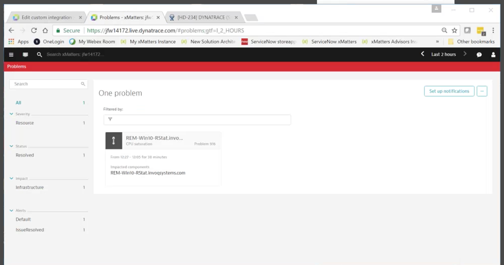
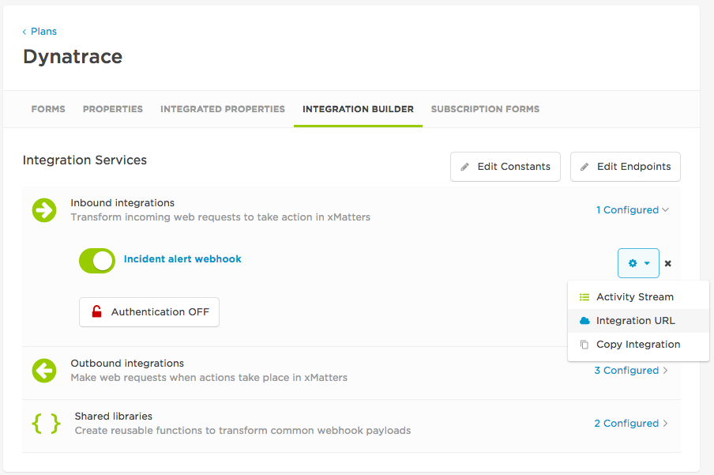
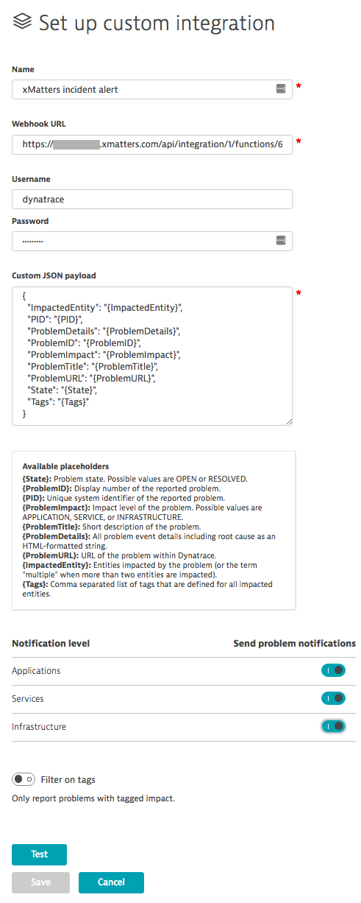
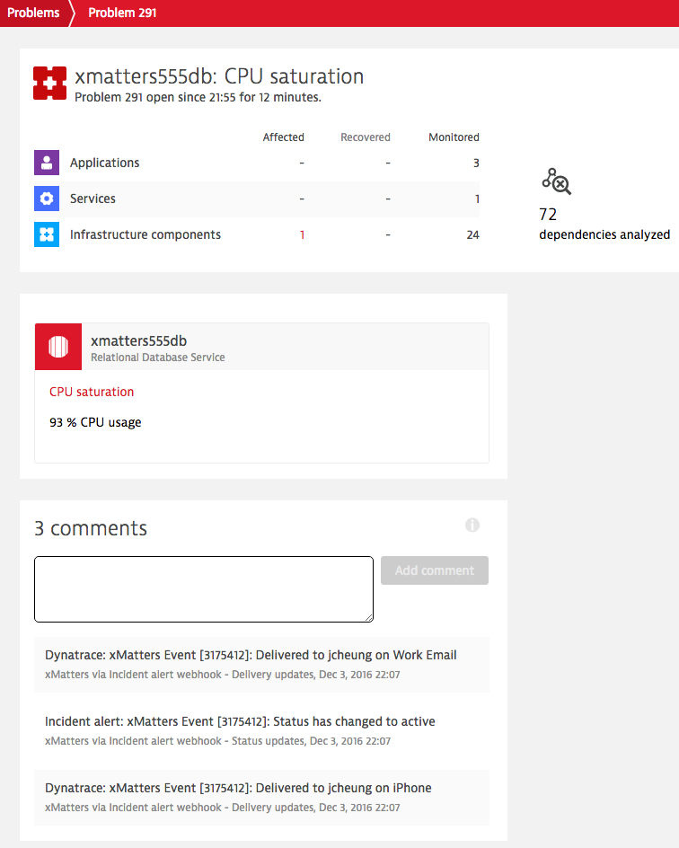
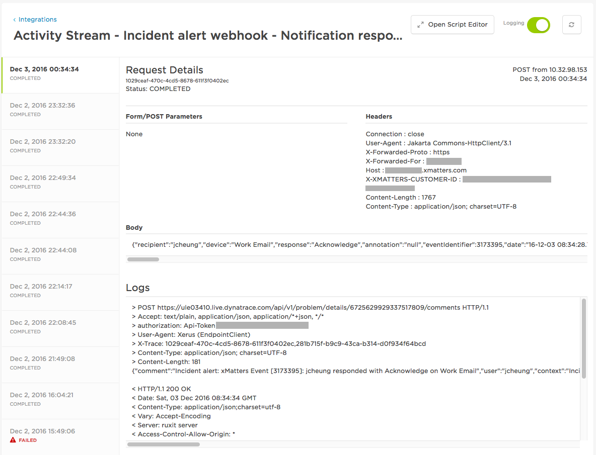
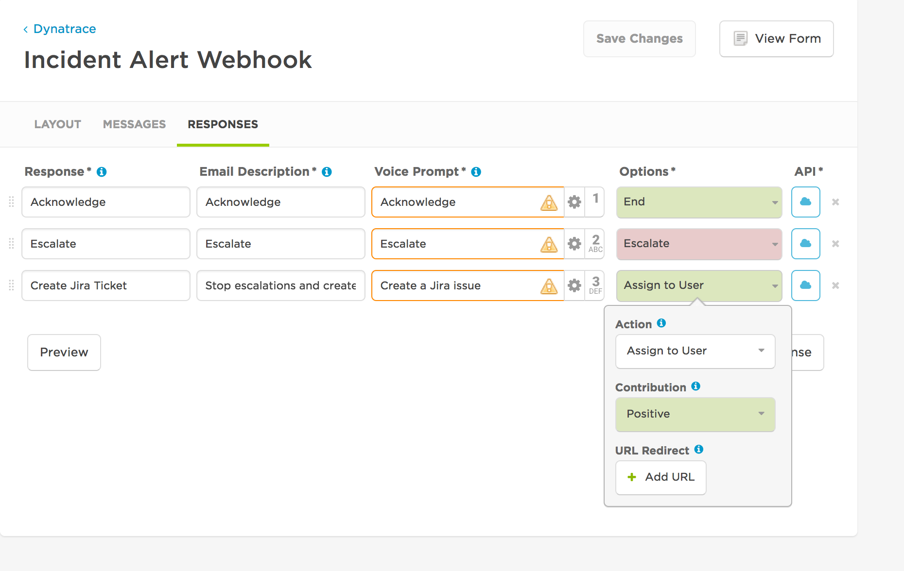
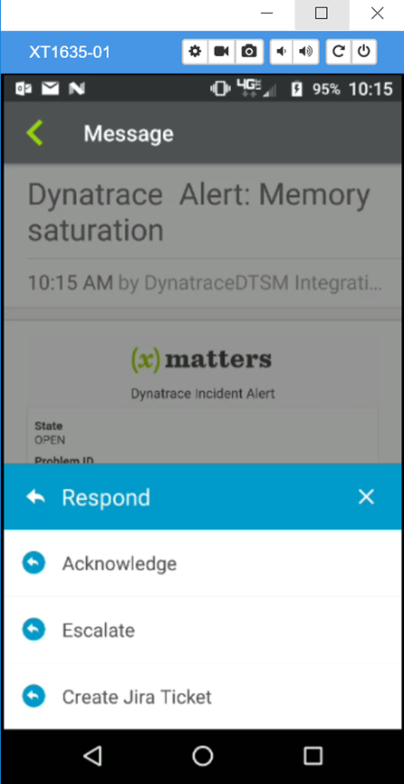

# Dynatrace
[Dynatrace](https://www.dynatrace.com) is a leading performance and application monitoring application. This integration extends the alerting capabilities to use xMatters. This is a closed loop integration for sending alerts out and updating the Problem in Dynatrace with event status, device delivery and response information from xMatters notifications. 

Checkout the video:
<kbd>
   <a href="images/xMattersDTSMIntegration.mp4"></a>
</kbd>

# Pre-Requisites
* [Dynatrace](https://www.dynatrace.com) Account
* xMatters account - If you don't have one, [get one](https://www.xmatters.com)!

# Files
* [Dynatrace.zip](Dynatrace.zip) - The communications plan Dynatrace sends events to
* [JiraOutboundResponse.js](JiraOutboundResponse.js) - Optional outbound response script for creating a Jira issue with the problem ID. See [below](#create-jira-issue) for details. 

# Installation

## Dynatrace Setup
First, request a Dynatrace API Token. 
You need to set a request header that includes an API token for authentication in each Dynatrace API call. To create your token in Dynatrace, click `Settings` on the left navigation menu. Then expand the `Integration` section and click `Dynatrace API`. Click on the `Generate key` button and enter a label for this integration, such as "xMatters-Integration" and click `Add`.
After an API token is generated, expand the xMatters-Integration entry in the `API Keys` section. Your API token appears in the Generated key text field.

<kbd>
	
</kbd>

For more details, see the [Dynatrace documentation](https://help.dynatrace.com/api-documentation/v1/authentication/)

## xMatters set up
### Create a REST API user
This integration requires a REST API user to authenticate REST web service calls when injecting events.
This user needs to be able to work with events, but does not need to update administrative settings. While you can use the default Company Supervisor role to authenticate REST web service calls, the best method is to create a user specifically for this integration with a dedicated "REST Web Service User" role that includes the permissions and capabilities.
If this role does not exist in your deployment already, you may need to ask your xMatters Client Success Manager to create it for you. In the following example, this role is named "REST Web Service User".
To create a REST API user:
1. Log in to the target xMatters system.
1. On the Users tab, click Add.
1. Enter the appropriate information for your new user. Because this user will affect how messages appear for recipients, you may want to identify the user as specific to Dynatrace. For example:
	1. First Name: Dynatrace
	1. Last Name: Integration
	1. User ID: dynatrace
1. In the Roles area, add the REST Web Service User role.
1. Click Add.
Make a note of the user credentials and details. You will need them when configuring other parts of this integration.

### Import the communication plan
The next step is to import the communication plan into xMatters.
To import the communication plan:
1. In the target xMatters system, click Import Plan from the Developer tab.
1. Click Choose File, and then locate the downloaded communication plan (.zip file).
1. Click Import Plan:
	* Importing the plan will automatically enable it, and enable its forms for web services.
1. Once the communication plan has been imported, click Edit > Forms.
1. For the AutoShare webhook form, click Web Service Only > Sender Permissions.
1. Enter the REST API user you created above, and then click Save Changes.

### Set notification recipients
The Dynatrace Incident form uses the default recipients specified on the Layout tab to determine who to notify about an incoming alert.
1. On the Forms tab, click Edit > Layout.
1. In the Recipients section, add all of the groups and users you want to receive Dynatrace Incident Alert notifications.
1. Click Save Changes.

### Configure integration settings
After you import the communication plan, you need to setup the xMatters and Dynatrace endpoints.
1. From the communication plan, click the Integration Builder tab, and then click Edit Endpoints.
1. Select the xMatters endpoint, specify the Username and Password of the Dynatrace REST API user you created above, and then click Save Changes.
1. Close the Endpoints dialog box.
1. Click Edit Constants
1. Select the `DYNATRACCE_API_TOKEN` constant, paste your Dynatrace API Token into the Value field, and then click Save Changes.

### Accessing URLs
The Incident alert webhook has a URL that you need to use to target it from Dynatrace.
To get the URL for an integration service:
1. On the Integration Builder tab, expand the list of inbound integrations.
1. Click the gear icon beside the Incident alert webhook, and then select Integration URL.

<kbd>
	
</kbd>

Copy the URL displayed in the dialog box to a text editor; you will use this URL in the next step.

## Configure Dynatrace
Now that you've configured xMatters to integrate with your system, it's time to configure Dynatrace to integrate with xMatters.
Note: The following sections require you to log into Dynatrace as an Environment Admin. Details on various roles and access levels in Dynatrace, see [here](https://help.dynatrace.com/get-started/good-to-know/how-do-i-set-up-user-groups-and-permissions/).

### Create a webhook integration
1. Login to Dynatrce
1. Click Settings on the left navigation menu
1. Expand the Integration section and click Problem notifications.
1. Select the Custom integration button.
   <kbd>
	  
   </kbd>
1. In the Set up custom integration enter the following information:
	* The name of the integration
	* The Integration URL for your inbound integration
	* The username password of the REST web service user
	* The Custom JSON payload. You can use the default setting, or copy and paste the following to get the complete data set.
		```json
		{
		  "ImpactedEntity": "{ImpactedEntity}",
		  "PID": "{PID}",
		  "ProblemDetails": "{ProblemDetails}",
		  "ProblemID": "{ProblemID}",
		  "ProblemImpact": "{ProblemImpact}",
		  "ProblemTitle": "{ProblemTitle}",
		  "ProblemURL": "{ProblemURL}",
		  "State": "{State}",
		  "Tags": "{Tags}"
		}
		```
	* Toggle all Applications, Services Infrastructure Notification level to ON.
1. Click Test button.
1. If the test succeeds, the Save button will be activated. Click the Save button. Otherwise, check the setting to make sure the Webhook URL and user credentials are entered correctly.

<kbd>
  
</kbd>


# Testing
To test the integration, run an application (or the lambda function) so that the CPU goes over the alert threshold.
<kbd>
  
</kbd>

The Incident alert will be triggered via the newly created Webhook, followed by these additional comments in the Activity Feed:
* An xMatters Event is created and set to Active
* A notification is sent to the recipient  


# Troubleshooting
There are several places you can inspect when troubleshooting why an Incident alert is not sent to xMatters, or when no responses are recorded in the Activity Feed. 

## Inbound to xMatters
The xMatters Integration Builder Activity Stream is a good place to look for when the the recipient doesn't receive any notification.  
While on the Integration Builder tab, expand the Inbound Integrations section, click the gear icon beside the intended integration service, and then click Activity Stream.
The Activity Stream contains the incoming request, any logging statements, and the final event creation messages.

## Outbound from xMatters
Similarly, the Activity Stream contains the outbound request sending to Dynatrace. The following example shows the Notification Responses activity stream: 
<kbd>
  
</kbd>


# Extras
## Create Jira Issue
The [JiraOutboundResponse.js](JiraOutboundResponse.js) script is an outbound integration script for creating a Jira issue from the Dynatrace problem. When responding with `Create Jira Ticket`, the jira issue will have the `dynatraceProblemId` set. If the Dynatrace Add-on for Jira is installed, the side panel will have the Dynatrace details. 

`IMAGE HERE of Jira issue`

### Installation steps
1. Login to the xMatters instance as a developer
2. On the Dynatrace communications plan, click Edit > Integration Builder.
3. Expand the Outbound Integrations and click Add. 
4. Populate the following values:

| Item | Value |
| ---- | ---- |
| Trigger | Notification responses |
| Form | Incident Alert Webhook |
| Action | Run a script |
| Location | Cloud |
| Name | Incident alert webhook - Notification responses - Create Jira Issue |
5. Click Edit Script and paste in the contents of the [JiraOutboundResponse.js](JiraOutboundResponse.js) script and click Save. 
6. Navigate to the `Incident Alert Webhook` form and click Edit > Responses. 
7. Add a response and populate the following values:

| Item | Value |
| ---- | ---- |
| Response | Create Jira Ticket |
| Email Description | Stop escalations and create a Jira issue |
| Voice Prompt | Create a Jira issue |
| Options | **Action**: Assign to User <br> **Contribution**: Positive | 

<kbd>
	
</kbd>
8. Next, add two constants with the following names and values, replacing with the relevant jira project settings:

| Name | Value |
| --- | --- |
| JIRA_PROJECT_KEY | `Jira Project Key here` <br> For example `HELP` |
| JIRA_ISSUE_TYPE | `Jira Issue Type` <br> for example `IT Help` |

### Testing
Trigger a problem from Dynatrace and select the `Create Jira Ticket` response option. 

<kbd>
	
</kbd>

Then, in Jira search for the new Jira issue:

IMAGEHERE

